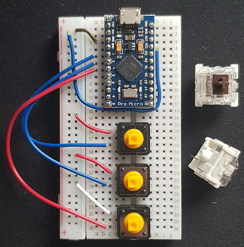

# KeyJect

Macro keyboard prototype project

## End goal is:

- Having a macro keyboard which could ease the programming work and for the looks.

## TODOs:

- Purchase enough components for development and depugging.
- Find online material and examples for learning from others mistakes.
- Gather list of automated tasks for buttons.
- Design sexy ass case and caps.

## Gathered material & Other similar projects:

The arduino Keyboard library:
https://www.arduino.cc/reference/en/language/functions/usb/keyboard/

Sparkfun tutorials:
https://www.sparkfun.com/tutorials/337

Matrix key project:
https://www.youtube.com/watch?v=ORujXGDqG_I

A good software to pair with (Study anyway)
https://autohotkey.com/download/

https://www.instructables.com/id/Custom-Macro-Mechanical-Keypad/

https://www.youtube.com/watch?v=L4e8mREQ85s
https://www.youtube.com/watch?v=MeYuIWGqquE
https://www.thingiverse.com/thing:3158734
https://www.youtube.com/watch?v=MeYuIWGqquE
https://www.partsnotincluded.com/diy-stream-deck-mini-macro-keyboard/
https://www.partsnotincluded.com/obs-studio-chat-hotkey-script/
